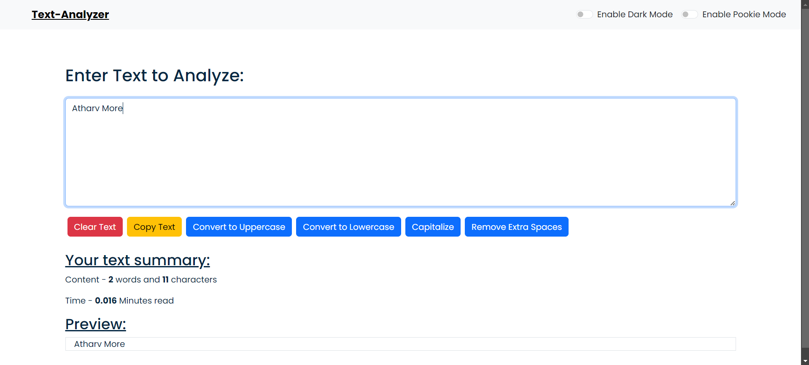
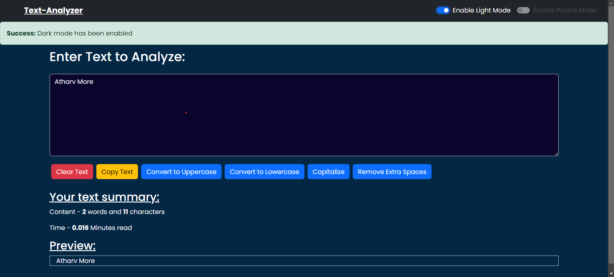

# Text-Analyzer using ReactJs

# Text-Analyzer using ReactJs

This project is a powerful and user-friendly text analysis tool built with React.js. The Text-Analyzer allows users to input text and gain insights through various analytical features. It is designed to help users understand text content better by providing statistics and transformations in an intuitive interface.

## Features

- **Word Count:** Get an accurate count of the total number of words in the input text.
- **Character Count:** Quickly calculate the total number of characters, including or excluding spaces.
- **Text Transformation:** Convert text to uppercase, lowercase, or capitalize each word with just a click.
- **Copy Text:** Easily copy the analyzed or transformed text to the clipboard.
- **Remove Extra Spaces:** Clean up the text by removing unnecessary whitespace between words.
- **Preview Text:** See a real-time preview of the text as it is being analyzed or transformed.
- **Dark Mode / Light Mode Toggle:** Switch between dark and light themes to suit your preference and reduce eye strain.
- **Pookie Mode:** A unique feature that transforms the interface into a fun, pink-themed experience.

## Installation and Setup Instructions

Follow these steps to get a local copy of the project up and running.

### Prerequisites

Make sure you have the following installed on your machine:

- [Node.js](https://nodejs.org/) (v12.0.0 or later)
- [npm](https://www.npmjs.com/)

### Clone the Repository

To clone the repository, run the following command in your terminal:

```bash
git clone https://github.com/your-username/Text-Analyzer.git
```

```bash
cd Text-Analyzer
npm install
```

```bash
npm run start
```

##Screenshots



